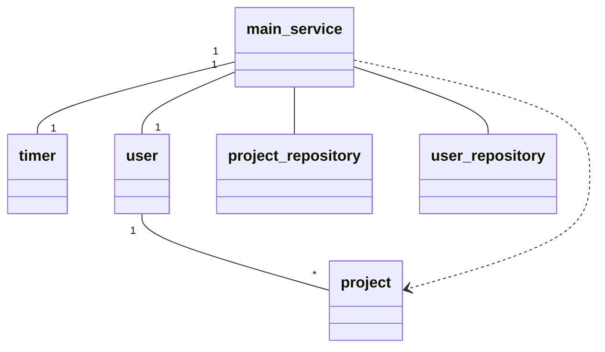
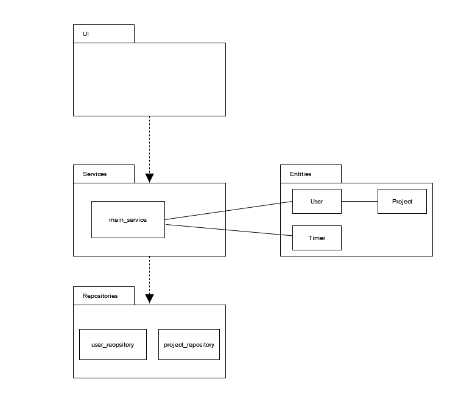
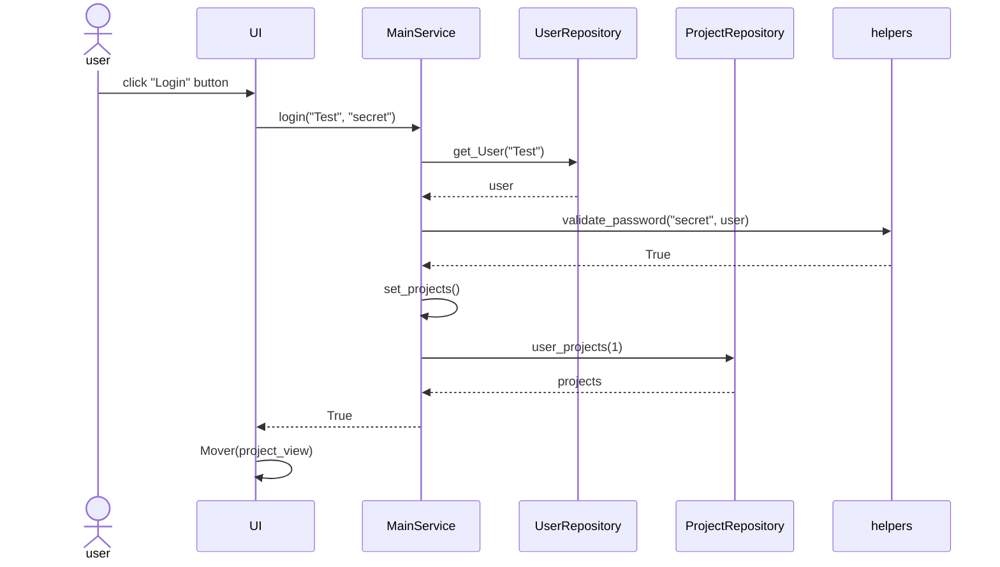

# Arkkitehtuurikuvaus

## Rakenne

Luokkakaavio:

Pakkausrakenne:

## Päätoiminnallisuudet

### Käyttäjän sisäänkirjautuminen

Käyttäjä painaa login-painiketta syötettetyään olemassa olevan käyttäjänimen ja oikean salasanan. Login painikkeen tapahtumankäsittelijä kutsuu Mainservicen metodia login parametreina käyttäjätunnus ja salasana. Mainservice kutsuu UserRepository olion metodia get_user parametrina käyttäjätunnus, joka tarkastaa onko tietokannassa olemassa kyseinen käyttäjätunnus ja palauttaa käyttäjätiedot. Tämän jälkeen Mainservice tarkistaa validate_password funktiolla, vastaako käyttäjän antama salasana tietokantaan tallennettua hashattua salasanaa. Seuraavaksi MainSErvice kutstuu ProjectRepositoryn metodia set_projects(), joka palauttaa sisäänkirjautuneen käyttäjän projektit. Mainservice palauttaa UI:lle True, jonka jälkeen UI muuttaa näkymäkseen project_view mover-metodin avulla.
