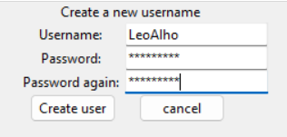
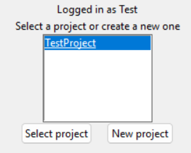
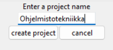
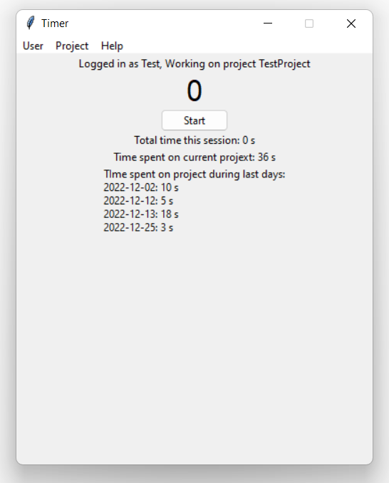
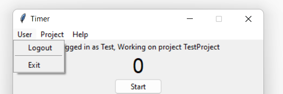

# Käyttöohje

Viimeisin [release](https://github.com/ohjelmistotekniikka-hy/python-todo-app/releases). Lataa releasen lähdekoodi Assetsien alla olevasta source codesta

## Konfigurointi

Käytettävän tietokannan tiedostonnimen voi konfiguroida juurihakemistossa olevassa .env tiedostossa laittamalla halutun tietokannan nimen **DATABASE_FILENAME**-muuttujan arvoksi. Esimerkiksi **DATABASE_FILENAME=tietokanta.db**. Tiedosto luodaan ./data hakemistoon. Oletusarvoinen tietokantanimi on database.db.

## Käynnistäminen

Ennen käynnistämistä asenna riippuvuuden komennolla **poetry install**

Tämän jälkeen alusta tietokanta komennolla **poetry run invoke build**

Ohjelma käynnistetään komennolla **poetry run invoke start**

## Kirjautuminen

Kirjautuminen tapahtuu kirjoittamalla käyttäjätunnus ja salasanat niitä vastaaviin kenttiin ja painamalla login painiketta. Sovelluksessa on tietokannan alustuksen yhteydessä luotu oletuskäyttäjä käyttäjänimellä "Test" ja salasanalla "secret".

## Uuden käyttäjän luominen
Kirjautumisnäkymässä on mahdollista luoda uusi käyttäjä painamalla "create user"-painiketta.

 Uusi käyttäjä luodaan syöttämällä valitsemasi käyttäjänimi ja salasana toistetusti niitä vastaaviin kenttiin ja painamalla "create user"-painiketta. Käyttäjän luomisen jälkeen sovellus siirtyy takaisin kirjautumisnäkymään. Käyttäjän luomisen vo peruuttaa painamalla "cancel"-painiketta.

## Projektin valinta

Kirjauduttua on käyttäjän valittava projekti. Tämä onnistuu valitsemalla projekti listasta, jossa on lueteltu kaikki projektit, joihin kyseisellä käyttäjällä on lupa osallistua. Projektin valinta vahvistetaan painamalla "Select project"-painiketta.

## Uuden projektin luominen

Uuden projektin luominen onnistuu painamalla new project-painiketta projektinvalintanäkymässä. Tämä avaa uuden näkymän.

Projektinluontinäkymässä syötä uuden projektin nimi tekstikenttään ja paina tämän jälkeen "create project"-painiketta. Projektinluonnin voi peruuttaa painamalla "cancel"-painiketta.

## Päänäkymä

Projektin valinnan jälkeen aukeaa sovelluksen päänäkymä.

Päänäkymässä näkyy tämänhetkinen ajanotto.

## Menubar

Päänäkymässä olevan menubarin avulla voi tehdä käyttäjään ja projektiin liittyviä muutoksia. Menubar koostuu kolmesta erillisestä valikosta.

### User

Logout: Kirjaa käyttäjän ulos ja siirtyy sisäänkirjautumisnäkymään
Exit: Sulkee koko sovelluksen

### Project

Export as...: Exporttaa tulosteen ajanotoista joko .pdf tai .txt muodossa
Close: Sulkee kyseisen projektin ja siirtyy projektinvalintanäkymään

### Help

Help: Avaa käyttäjän oletusselaimessa käyttöohjeen

User-valikon 
