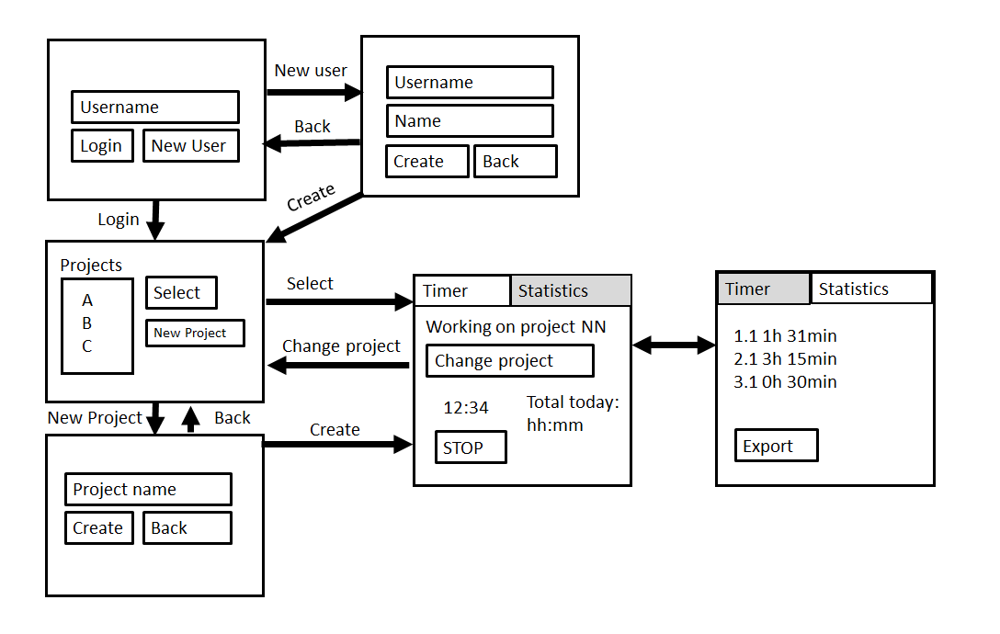

# Vaatimusmäärittely

## Sovelluksen tarkoitus

Sovelluksen tarkoituksena on seurata töiden ja muiden projektien ajankäyttöä. Sovelluksessa on mahdollista luoda projekteja, joiden ajankäyttöä seurataan, seurata ajankäyttöä sovelluksen päänäkymässä olevalla ajastimella, sekä luoda projekteista käyttäjän määrittelemiä tulosteita, joista näkyy projektin ajankäyttöön liittyvää dataa.

## Käyttäjäryhmät

Sovelluksessa on toistaiseksi vain yksi käyttäjäryhmä: normaali käyttäjä

## Käyttöliittymäluonnos

## Toiminnallisuus

### Kirjautumisnäkymä

- [x] Käyttäjä voi luoda käyttäjätunnuksen
- [] virheellisen tiedon käyttäjää luodessa aiheuttaa virheilmoituksen
- [] Kirjautuminen vaatii salasanan
- [] salasana on kryptattu
- [] väärä käyttäjänimi/salasana antaa virheilmoituksen

### Projektinäkymä
- [x] Käyttäjä voi valita jo olemassa olevan projektin tai luoda uusi projekti, jonka ajankäyttöä seurataan

### Päänäkymä
- [] Päänäkymä koostuu itse ajastimesta, sekä osiosta, jossa näytetään projektiin liittyvä tilastotietoa sekä voidaan luoda tulosteita
- [x] Käyttäjä voi aloittaa tai pysäyttää ajastimen
- [x] Käyttäjä voi vaihtaa projektista toiseen, palaamalla takaisin projektinäkymään
- [x] Päänäkymässä näkyy paljonko on käytetty aikaa koko päivän/viikon aikana kyseiseen projektiin
- [x] Päänäkymässä näkyvät kyseisen projektin kaikki ajanottokerrat ja näiden summa sekä on mahdollista exportaa kyseinen näkymä .txt muodossa.

## Jatkokehitysideoita
- Päänäkymän toiminnallisuuden siirtäminen painikkeista ylälaidassa olevaan manubarin
- Ajastimen pysäyttämisen yhteydessä käyttäjän on mahdollita kirjoittaa kommentti viimeiseen ajanottoon liittyen
- Tulosteiden laatiminen .pdf-muodossa
- Mahdollista nähdä ajankäytön keskiarvot/mediaanit
- github contributions -kaltainen näkymä
- Näkymä, jossa näkyy mihin vrk aikaan kyseisen projektin kanssa on tehty töitä
- Mahdollisuus näyttää ajankäyttö per vrk, viikko tai kuukausi
- Mahdollisuus luoda projektiin päivä/viikkotavoite. Sovellukseen näkymä, joka näyttää paljonko kyseisestä tavoitteesta on täyttymättä
- Mahdollisuus jakaa projekteja muiden käyttäjien kanssa
- Mahdollisuus projektia luodessa luoda kirjan luku/kirjoitusprojekti. Tähän mahdollisuus lisätä päivittäinen sivutavoite sekä päänäkymässä uusi painike, joll merkataan kun uusi sivu on luettu.
