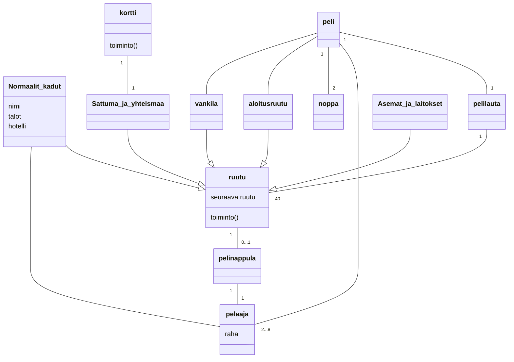

```mermaid
classDiagram
	class ruutu{
		seuraava ruutu
		toiminto()
	}
	class kortti{
		toiminto()
	}
	class pelaaja{
		raha
	}
	class Normaalit_kadut {
		nimi
		talot
		hotelli
	}
	peli "1" -- "1" pelilauta
	peli -- "2...8" pelaaja
	peli "1" -- "2" noppa
	peli -- aloitusruutu
	peli -- vankila
	vankila --|> ruutu
	aloitusruutu --|> ruutu
	Sattuma_ja_yhteismaa --|> ruutu
	Asemat_ja_laitokset --|> ruutu
	Normaalit_kadut --|> ruutu
	Normaalit_kadut -- pelaaja
	kortti "1" -- "1" Sattuma_ja_yhteismaa
	ruutu "1" -- "0...1" pelinappula
	pelinappula "1" -- "1" pelaaja
	pelilauta "1" -- "40"  ruutu
```
	
