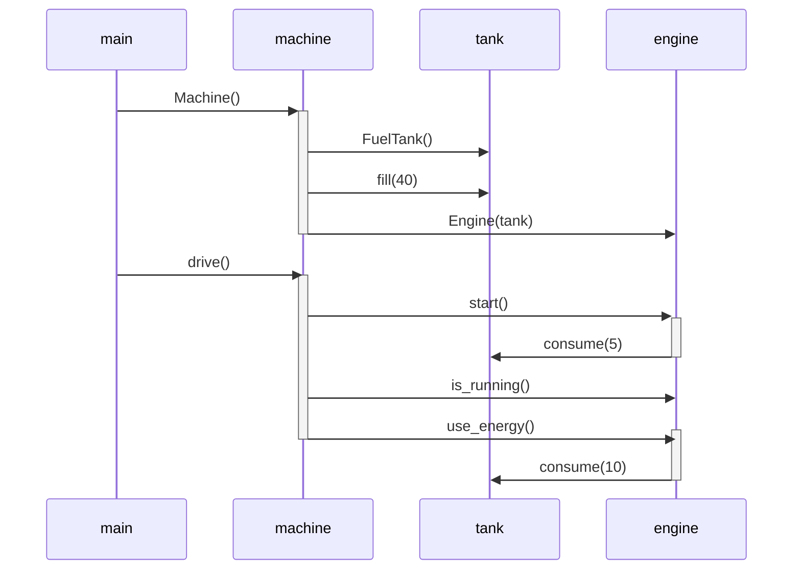

```mermaid
sequenceDiagram
main ->> + machine: Machine()
machine ->> tank: FuelTank()
machine ->> tank: fill(40)
machine ->> - engine: Engine(tank)
main ->> machine: drive()
activate machine
machine ->> + engine: start()
engine ->> - tank: consume(5)
machine ->> engine: is_running()
machine ->> engine: use_energy()
activate engine
deactivate machine
engine ->> tank: consume(10)
deactivate engine

```
